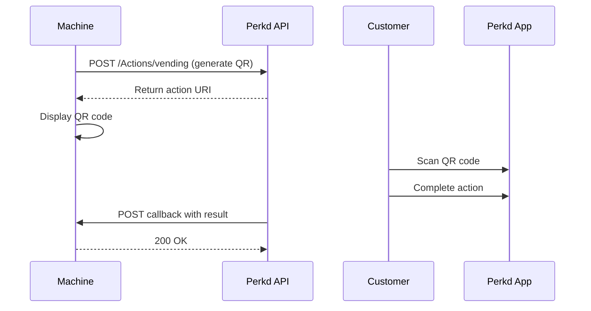

# Getting Started

Welcome to the Perkd Partner API! This guide will help you integrate your vending machines and kiosks with Perkd's digital wallet platform.

## How It Works

The Perkd Machine API uses a simple flow:

1. **Generate Action QR** - Your machine calls our API to generate a unique action URL
2. **Customer Scans** - Customer scans the QR code with the Perkd mobile app
3. **Customer Interacts** - Customer completes the action in the app (order, payment, etc.)
4. **Receive Callback** - Your machine receives the result via webhook callback

## What You'll Integrate

### Vending Machines
- **Check In** - Identify customers and show available pickups
- **Order** - Create orders for immediate purchase
- **Pickup** - Dispense pre-ordered or sample items
- **Pay** - Collect payment or authorize funds

### Kiosks
- **Order** - Create orders with payment at self-service kiosks

## Prerequisites

Before you begin, collect the following from Perkd:

| Item | Description | Example |
|------|-------------|---------|
| **API Key** | Authentication key for API calls | `pk_test_abc123...` |
| **Digital Card** | Test card in Perkd app for testing | Provided by Perkd staff |
| **Environment URL** | Test or production endpoint | `https://api.perkd.io/test` |

And prepare to provide to Perkd:

| Item | Description | Example |
|------|-------------|---------|
| **Callback Endpoint** | Universal URL to receive webhooks | `https://yourdomain.com/perkd/callbacks` |
| **Machine IDs** | Unique ID for each machine | `machine-001`, `kiosk-hq-floor2` |
| **IP Addresses** | Machine IPs for whitelisting | `203.0.113.42` |

## Next Steps

  
📋 Setup Checklist

  <ul>
    <li><a href="/getting-started/setup">Complete setup requirements</a></li>
    <li><a href="/getting-started/environments">Understand test vs production</a></li>
    <li><a href="/getting-started/authentication">Configure API authentication</a></li>
    <li><a href="/machines/">Explore Machine APIs</a></li>
  </ul>

[Continue to Setup →](/getting-started/setup)
