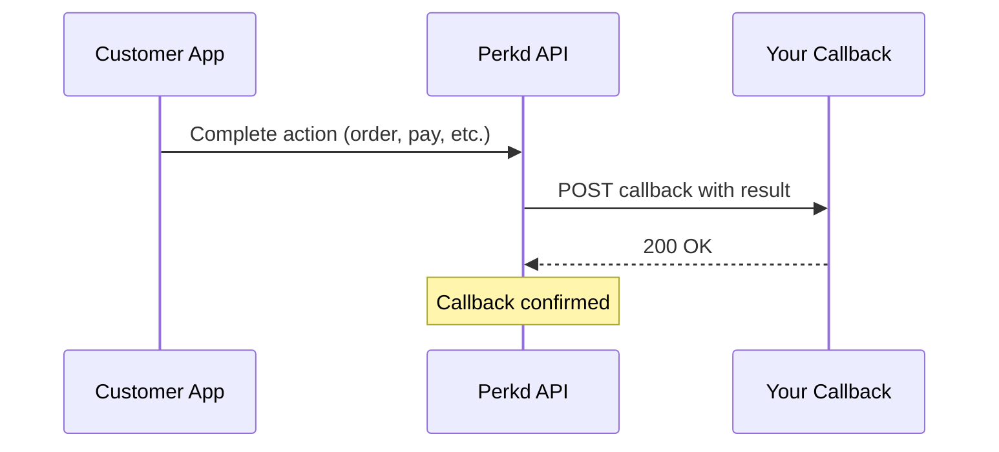

# Callbacks Overview

When customers complete actions in the Perkd app, results are sent to your callback endpoints via webhooks.

## How Callbacks Work



## Callback Endpoints

Your callback URL structure:

```
{your_base_url}/perkd/{action}/{machineId}
```

### Supported Actions

| Action | Callback URL | Trigger |
|--------|--------------|---------|
| Check In | `POST /perkd/checkin/{machineId}` | Customer checks in |
| Order | `POST /perkd/order/{machineId}` | Order payment complete |
| Pickup | `POST /perkd/pickup/{machineId}` | Pickup confirmed |
| Pay | `POST /perkd/pay/{machineId}` | Payment complete |
| Authorize | `POST /perkd/authorize/{machineId}` | Authorization complete |
| Reserve | `POST /perkd/reserve/{machineId}` | Reservation confirmed |

## Callback Requirements

Your endpoints must:

✅ **Accept POST requests** with JSON body
✅ **Return `200 OK`** on success
✅ **Respond within 10 seconds**
✅ **Use HTTPS** (required)
✅ **Handle retries** idempotently

## Response Format

Always return `200 OK` with JSON body:

```javascript
app.post('/perkd/:action/:machineId', (req, res) => {
  // Process callback
  processCallback(req.body);

  // Return 200 OK
  res.status(200).json({ received: true });
});
```

::: warning Important
Return `200 OK` even if processing fails internally. Only return non-200 if you want Perkd to retry.
:::

## Retry Logic

Perkd retries callbacks until receiving `200 OK`:

| Attempt | Delay | Total Time |
|---------|-------|------------|
| 1 | Immediate | 0s |
| 2 | 5s | 5s |
| 3 | 10s | 15s |
| 4 | 30s | 45s |
| 5 | 60s | 1m 45s |
| 6+ | 120s | ... |

Maximum retries: ~24 hours

## Common Callback Fields

All callbacks include:

```typescript
{
  status: 'success' | 'fail';  // Action result
  referenceId: string;          // Your tracking ID (if provided)
  // ... action-specific fields
}
```

## Idempotency

Handle duplicate callbacks safely:

```javascript
const processedCallbacks = new Set();

app.post('/perkd/:action/:machineId', (req, res) => {
  const { referenceId } = req.body;

  // Check if already processed
  if (processedCallbacks.has(referenceId)) {
    console.log('Duplicate callback:', referenceId);
    return res.status(200).json({ received: true, duplicate: true });
  }

  // Process callback
  processCallback(req.body);
  processedCallbacks.add(referenceId);

  res.status(200).json({ received: true });
});
```

## Security

### IP Whitelisting

Perkd callbacks come from whitelisted IPs. Contact Perkd for the IP list.

### Validate Payloads

Always validate callback data:

```javascript
function validateCallback(payload) {
  // Required fields
  if (!payload.status || !payload.referenceId) {
    return false;
  }

  // Verify referenceId matches your records
  if (!isKnownReference(payload.referenceId)) {
    return false;
  }

  // Action-specific validation
  // ...

  return true;
}

app.post('/perkd/:action/:machineId', (req, res) => {
  if (!validateCallback(req.body)) {
    console.error('Invalid callback:', req.body);
    // Still return 200 to stop retries
    return res.status(200).json({ received: false, error: 'Invalid payload' });
  }

  // Process valid callback
  // ...
});
```

## Error Handling

### Processing Errors

Log but acknowledge:

```javascript
app.post('/perkd/:action/:machineId', async (req, res) => {
  try {
    await processCallback(req.body);
    res.status(200).json({ received: true });
  } catch (error) {
    // Log error
    console.error('Callback processing failed:', error);

    // Still return 200 to stop retries
    res.status(200).json({
      received: true,
      error: error.message
    });

    // Handle error asynchronously
    handleCallbackError(req.body, error);
  }
});
```

### When to Return Non-200

Only return non-200 if you want retries:

```javascript
app.post('/perkd/:action/:machineId', (req, res) => {
  // Temporary issue - want retry
  if (isDatabaseDown()) {
    return res.status(503).json({ error: 'Service unavailable' });
  }

  // Permanent issue - don't retry
  if (!isValidPayload(req.body)) {
    return res.status(200).json({ received: false, error: 'Invalid' });
  }

  // Process...
});
```

## Testing Callbacks

### Local Testing with ngrok

```bash
# Install ngrok
npm install -g ngrok

# Start your server
node server.js

# Expose to internet
ngrok http 3000

# Use ngrok URL as callback endpoint
# https://abc123.ngrok.io/perkd/order/machine-001
```

### Test Webhook Tools

- [Webhook.site](https://webhook.site) - Inspect webhook payloads
- [RequestBin](https://requestbin.com) - Debug HTTP requests
- [ngrok](https://ngrok.com) - Local tunnel

## Monitoring

### Track Callback Health

```javascript
const callbackMetrics = {
  received: 0,
  success: 0,
  failed: 0,
  averageProcessingTime: 0
};

app.post('/perkd/:action/:machineId', async (req, res) => {
  const startTime = Date.now();
  callbackMetrics.received++;

  try {
    await processCallback(req.body);
    callbackMetrics.success++;
  } catch (error) {
    callbackMetrics.failed++;
  } finally {
    const duration = Date.now() - startTime;
    callbackMetrics.averageProcessingTime =
      (callbackMetrics.averageProcessingTime * (callbackMetrics.received - 1) + duration) /
      callbackMetrics.received;
  }

  res.status(200).json({ received: true });
});

// Expose metrics endpoint
app.get('/metrics', (req, res) => {
  res.json(callbackMetrics);
});
```

## Callback Reference

Detailed documentation for each callback:

- [Check In Callback](/machines/callbacks/checkin)
- [Order Callback](/machines/callbacks/order)
- [Pickup Callback](/machines/callbacks/pickup)
- [Pay Callback](/machines/callbacks/pay)
- [Authorize Callback](/machines/callbacks/authorize)
- [Reserve Callback](/machines/callbacks/reserve)

## Best Practices

1. ✅ **Return 200 OK immediately**
2. ✅ **Process asynchronously if slow**
3. ✅ **Log all callbacks**
4. ✅ **Implement idempotency**
5. ✅ **Validate all fields**
6. ✅ **Monitor callback health**
7. ✅ **Handle retries gracefully**
8. ✅ **Use HTTPS always**
