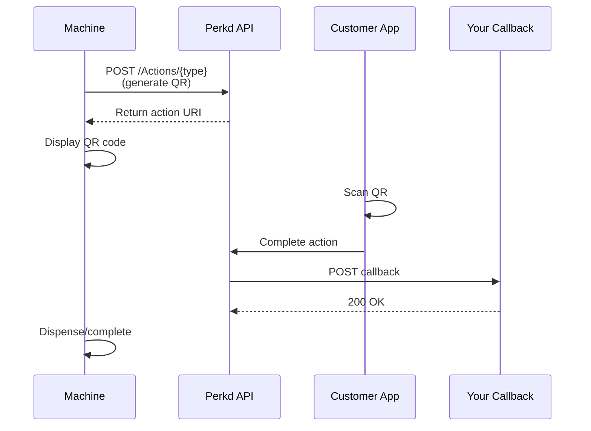

# Machine APIs

The Perkd Machine API enables vending machines and kiosks to accept payments and process orders through the Perkd digital wallet app.

## Overview

Machine APIs use an **Action-based model**:

1. Your machine **generates an Action QR code** via API
2. Customer **scans the QR** with Perkd app
3. Customer **completes the action** in the app
4. Perkd **sends result to your callback endpoint**

## Supported Machines

### Vending Machines

Full feature set for unattended vending:

| Action | Purpose | Use Case |
|--------|---------|----------|
| [**Check In**](/machines/vending/checkin) | Identify customer, show pickups | Member recognition, pre-orders |
| [**Order**](/machines/vending/order) | Create purchase order | On-site product selection |
| [**Pickup**](/machines/vending/pickup) | Dispense items | Sample redemption, pre-paid orders |
| [**Pay**](/machines/vending/pay) | Collect payment | Parking, services, deposits |

### Kiosks

Simplified ordering for self-service kiosks:

| Action | Purpose | Use Case |
|--------|---------|----------|
| [**Order**](/machines/kiosk/order) | Create purchase order | Self-checkout, food ordering |

## Action Flow



## Quick Start

### 1. Generate Action QR

```bash
POST https://api.perkd.io/prod/Actions/vending
```

**Headers:**
```
x-api-key: YOUR_API_KEY
Content-Type: application/json
```

**Body:**
```json
{
  "action": "order",
  "machineId": "machine-001",
  "items": [
    {
      "title": "Coke",
      "sku": "COLA_COKE01",
      "unitPrice": 3.00,
      "quantity": 1,
      "inventory": 10,
      "images": ["https://example.com/coke.jpg"]
    }
  ],
  "referenceId": "order-12345"
}
```

**Response:**
```json
{
  "uri": "https://app.perkd.me/64633389e1788b003a234a3b?p=AlTJD..."
}
```

### 2. Display QR Code

Encode the `uri` as a QR code for customers to scan.

### 3. Receive Callback

Your callback endpoint receives the result:

```http
POST https://yourdomain.com/perkd/order/machine-001
Content-Type: application/json

{
  "status": "success",
  "items": [...],
  "referenceId": "order-12345"
}
```

Return `200 OK` to acknowledge receipt.

## Endpoints

### Base URLs

| Environment | URL |
|-------------|-----|
| Test | `https://api.perkd.io/test` |
| Production | `https://api.perkd.io/prod` |

### Action Generation

```
POST /Actions/vending    # Vending machine actions
POST /Actions/kiosk      # Kiosk actions
```

### Payment Management

```
POST /Pay/commit         # Capture authorized payment
POST /Pay/cancel         # Cancel authorized payment
```

### Callbacks (Your Endpoints)

```
POST {your_url}/perkd/checkin/{machineId}
POST {your_url}/perkd/order/{machineId}
POST {your_url}/perkd/pickup/{machineId}
POST {your_url}/perkd/pay/{machineId}
POST {your_url}/perkd/authorize/{machineId}
POST {your_url}/perkd/reserve/{machineId}
```

## Common Parameters

### Machine Identification

All actions require a unique `machineId`:

```json
{
  "machineId": "vm-hq-floor1-a"
}
```

::: tip Machine ID Best Practices
- Use consistent naming (e.g., `{type}-{location}-{identifier}`)
- Keep them URL-safe (alphanumeric + hyphens)
- Make them globally unique across all your machines
:::

### Reference ID

Optional identifier to track requests:

```json
{
  "referenceId": "session-001"
}
```

Use this to:
- Match callbacks to requests
- Track transactions
- Debug issues
- Implement idempotency

## Response Format

### Success Response

```json
{
  "uri": "https://app.perkd.me/123?p=encrypted_params"
}
```

The `uri` contains an action link that can be:
- Encoded as QR code
- Embedded in NFC tag
- Sent as deep link

### Error Response

```json
{
  "error": "InvalidRequest",
  "message": "Missing required field: machineId"
}
```

## Action Validity

Generated action URIs are valid for **1 hour** by default.

After expiration:
- QR codes cannot be scanned
- App shows "expired" message
- Generate a new action QR

## Next Steps

<div class="tip custom-block">
  <p class="custom-block-title">🎯 Choose Your Path</p>

  **By Machine Type:**
  - [Vending Machine APIs](/machines/vending/checkin)
  - [Kiosk APIs](/machines/kiosk/order)

  **By Feature:**
  - [Callbacks Overview](/machines/callbacks/)
  - [Payment Management](/machines/payment/)
  - [Data Schemas](/schemas/)
</div>
