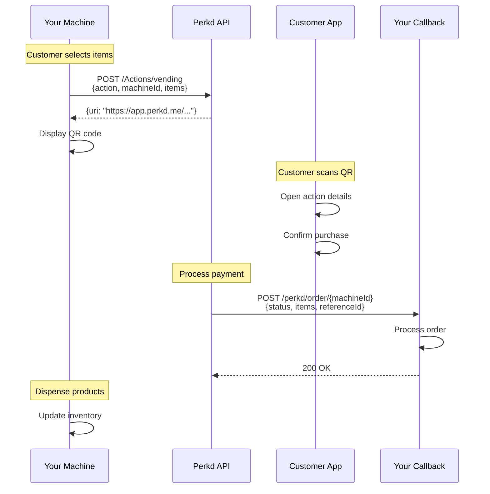

# How It Works

Understanding the Machine API flow from start to finish.

## The Action Model

Perkd uses an **Action-based architecture** where every customer interaction begins with a generated action link.

### What is an Action?

An Action is a predefined task that:
- Has a specific purpose (check in, order, pay, etc.)
- Contains all necessary parameters
- Is encoded as a secure URI
- Can be presented as QR code or NFC tag
- Expires after 1 hour (default)

## Complete Flow

### 1. Generate Action

Your machine calls the Perkd API to create an action:

```javascript
const response = await fetch('https://api.perkd.io/prod/Actions/vending', {
  method: 'POST',
  headers: {
    'x-api-key': API_KEY,
    'Content-Type': 'application/json'
  },
  body: JSON.stringify({
    action: 'order',
    machineId: 'machine-001',
    items: [{
      title: 'Coke',
      sku: 'COLA_COKE01',
      unitPrice: 3.00,
      quantity: 1,
      images: ['https://example.com/coke.jpg']
    }],
    referenceId: 'order-12345'
  })
});

const { uri } = await response.json();
// uri: "https://app.perkd.me/64633389e1788b003a234a3b?p=..."
```

### 2. Display QR Code

Convert the URI to a QR code for customers to scan:

```javascript
import QRCode from 'qrcode';

// Generate QR code image
await QRCode.toFile('qr-code.png', uri);

// Or display on screen
displayQROnScreen(uri);
```

### 3. Customer Scans

Customer uses the Perkd app to:
1. Open QR scanner
2. Scan the machine's QR code
3. View action details in app
4. Confirm or complete the action

### 4. Receive Callback

Perkd sends the result to your callback endpoint:

```http
POST https://yourdomain.com/perkd/order/machine-001
Content-Type: application/json

{
  "status": "success",
  "items": [
    {
      "title": "Coke",
      "sku": "COLA_COKE01",
      "unitPrice": 3.00,
      "quantity": 1,
      "images": ["https://example.com/coke.jpg"]
    }
  ],
  "referenceId": "order-12345"
}
```

### 5. Process & Respond

Your machine:
1. Validates the callback
2. Processes the order (dispense, update stock, etc.)
3. Returns `200 OK`

```javascript
app.post('/perkd/:action/:machineId', async (req, res) => {
  const { action, machineId } = req.params;
  const payload = req.body;

  // Validate callback
  if (!validateCallback(payload)) {
    return res.status(400).json({ error: 'Invalid payload' });
  }

  // Process action
  if (payload.status === 'success') {
    await dispenseProduts(machineId, payload.items);
    await updateInventory(payload.items);
  }

  // Acknowledge receipt
  res.status(200).json({ received: true });
});
```

## Sequence Diagram



## Action Types

### Check In
**Purpose:** Identify customer and show available pickups

**Flow:**
1. Customer scans check-in QR
2. App shows member profile
3. App displays available pre-orders
4. Callback includes member info + pickup orders

**Use Cases:**
- Member recognition
- Show pre-ordered items
- Display loyalty status
- Offer personalized promotions

### Order
**Purpose:** Create and pay for immediate purchase

**Flow:**
1. Customer selects items on machine
2. Machine generates order QR
3. Customer scans and pays
4. Callback confirms payment
5. Machine dispenses items

**Use Cases:**
- Standard vending purchase
- Kiosk self-checkout
- Food ordering

### Pickup
**Purpose:** Dispense pre-paid or sample items

**Flow:**
1. Machine generates pickup QR for specific items
2. Customer scans to confirm
3. App verifies entitlement
4. Callback confirms pickup
5. Machine dispenses items

**Use Cases:**
- Pre-ordered item pickup
- Sample redemption
- Loyalty reward fulfillment

### Pay
**Purpose:** Collect payment or authorize funds

**Flow:**
1. Machine generates payment QR
2. Customer scans and authorizes payment
3. Callback confirms authorization
4. Optional: Later capture with `/Pay/commit`

**Use Cases:**
- Parking fees
- Service deposits
- Pre-authorization

## Callback Reliability

### Retry Logic

Perkd automatically retries callbacks until receiving `200 OK`:

| Attempt | Delay | Total Time |
|---------|-------|------------|
| 1 | Immediate | 0s |
| 2 | 5s | 5s |
| 3 | 10s | 15s |
| 4 | 30s | 45s |
| 5 | 60s | 1m 45s |
| ... | ... | ... |

::: warning Implement Idempotency
Handle duplicate callbacks gracefully using `referenceId` to track processed requests.
:::

### Callback Requirements

Your callback endpoint must:

- ✅ Return `200 OK` on success
- ✅ Process requests idempotently
- ✅ Respond within 10 seconds
- ✅ Use HTTPS
- ✅ Handle retries gracefully

## Error Handling

### API Errors

When generating actions:

```javascript
try {
  const response = await generateAction({...});
  if (!response.ok) {
    const error = await response.json();
    console.error('API Error:', error.message);
    // Show error on machine display
  }
} catch (err) {
  console.error('Network Error:', err);
  // Retry or show offline message
}
```

### Callback Errors

When processing callbacks:

```javascript
app.post('/perkd/:action/:machineId', (req, res) => {
  try {
    // Process callback
    processAction(req.body);
    res.status(200).json({ received: true });
  } catch (err) {
    // Log error but still return 200 if processed
    console.error('Processing error:', err);
    res.status(200).json({ received: true, error: err.message });
  }
});
```

::: tip Return 200 Even on Errors
Return `200 OK` to stop retries, but log the error for investigation. Only return non-200 if you want Perkd to retry.
:::

## Security Considerations

### Validate Callbacks

Always validate callback payloads:

```javascript
function validateCallback(payload) {
  // Check required fields
  if (!payload.status || !payload.referenceId) {
    return false;
  }

  // Verify referenceId matches your records
  if (!isValidReferenceId(payload.referenceId)) {
    return false;
  }

  // Additional validation...
  return true;
}
```

### IP Whitelisting

Perkd uses IP whitelisting for your machines. Ensure:
- Machines have static IPs
- IPs are registered with Perkd
- Firewall allows outbound HTTPS

## Best Practices

### 1. Use Reference IDs

Always include `referenceId` to track requests:

```javascript
const referenceId = `order-${Date.now()}-${machineId}`;
```

### 2. Handle Timeouts

Action URIs expire after 1 hour:

```javascript
// Clear QR code after timeout
setTimeout(() => {
  clearQRCode();
  showIdleScreen();
}, 60 * 60 * 1000); // 1 hour
```

### 3. Log Everything

Log all API calls and callbacks:

```javascript
console.log('[PERKD] Generated action:', {
  action: 'order',
  machineId,
  referenceId,
  timestamp: new Date().toISOString()
});
```

### 4. Monitor Health

Track success rates:

```javascript
const metrics = {
  actionsGenerated: 0,
  callbacksReceived: 0,
  successRate: () =>
    metrics.callbacksReceived / metrics.actionsGenerated
};
```

## Next Steps

Ready to implement? Choose your machine type:

- [Vending Machine APIs](/machines/vending/checkin)
- [Kiosk APIs](/machines/kiosk/order)
- [Callback Reference](/machines/callbacks/)
- [Data Schemas](/schemas/)
